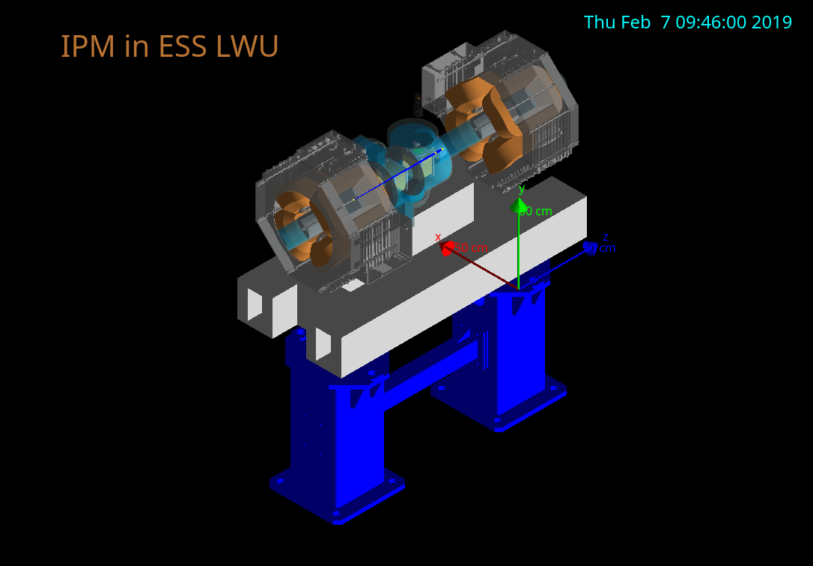

# Geant4ESS

This Geant4 simulation tries to cover the case of interaction between proton losses and the critical parts of the IPMs.
A LWU-like geometry has been implemented.

Each sensitive detector may fill an histogram or a NTuple.
The histograms or NTuples are then saved into a ROOT file.
The simulation uses the native Multi Threading capabilities of Geant4.
The program can use the G4mpi interface and should be MPI ready.



## Requierements

- CMake >= version 3.6
- Geant4 >= version 10.04
- CADMesh >= version 2 (beta)
- FreeCAD >= 0.16 (optional: for STEP to STL convertion)
- ROOT >= 6 (optional: for data processing)
- MPI (optional: for parallel computing on clusters)

## Build

```sh
mkdir build
cd build
cmake ..
make -jN
```

MPI support can be activated:

## Usage

To run in UI (Qt) interactive mode:
```sh
./Geant4ESS
```

Or execute a macro:
```sh
./Geant4ESS run.mac
```

In MPI enable mode, only the batch interactive mode is available.
```sh
mpiexec --hostfile MPIhost -x ENV_VAR Geant4ESS
```